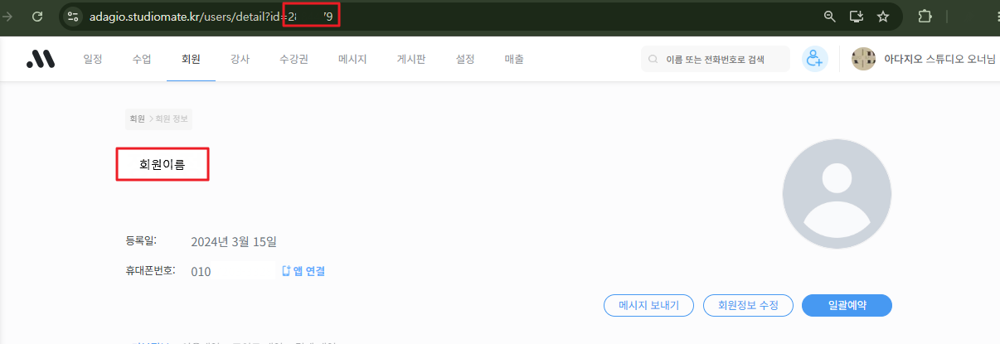

# 아다지오 수강신청 시스템 — 테스터 가이드

## 계정 유형 및 권한 요약

| 구분 | 일반 회원 (USER) | 관리자 (ADMIN) |
|---|---|---|
| 접근 경로 | `/courses`, `/result`, `/mypage`, `/special`, `/coupons`, `/notices` | `/admin/*` 전용 |
| 수강신청 | ✅ 직접 신청 가능 | ❌ (관리자는 일반 경로 접근 시 `/admin/dashboard`로 리다이렉트) |
| 회원 관리 | ❌ | ✅ 승인·거절·상태 변경·삭제 |
| 수업 관리 | ❌ | ✅ 등록·수정·삭제 |
| 입금 관리 | ❌ | ✅ 상태 변경·일괄 처리 |
| 강사 관리 | ❌ | ✅ |
| 시스템 설정 | ❌ | ✅ |

---

## 1. 계정 상태 흐름

```
회원가입 → PENDING(승인 대기)
    ├─ 관리자 승인 → ACTIVE (수강신청 가능)
    ├─ 관리자 거절 → REJECTED (로그인은 되나 서비스 이용 불가)
    └─ 관리자가 DORMANT / SUSPENDED 처리 가능
```

- **PENDING**: 가입 신청 후 승인 대기 중. 로그인 후 `/pending` 페이지로 이동하며 서비스 이용 불가.
- **ACTIVE**: 정상 이용 가능 상태.
- **DORMANT**: 휴면 처리. 로그인 후 `/pending?status=DORMANT`로 이동.
- **REJECTED**: 거절. 로그인 후 `/pending?status=REJECTED`로 이동.
- **SUSPENDED**: 정지. 로그인 후 `/pending?status=SUSPENDED`로 이동.

---

## 2. 회원 등급

| 등급 | 설명 | 동호회비 |
|---|---|---|
| 정회원 (REGULAR) | 수강료만 납부 | ❌ |
| 준회원 (ASSOCIATE) | 수강료 + 동호회비 납부 | ✅ |

등급은 **관리자가 승인 시 지정**하며, 이후 관리자만 변경 가능합니다.

---

## 3. 테스트 시나리오

### 3-1. 회원가입 및 승인 플로우

**테스트 대상**: 신규 사용자

1. `/register` 접속
2. 아래 정보 입력:
   - **로그인 아이디**: 영문·숫자 4~20자 (포탈 ID와 별개)
   - **비밀번호**: 6자 이상
   - **이름**: 실명
   - **전화번호**: 스튜디오메이트에 등록된 번호
   - **사내 포탈 ID** (Knox ID): 암호화 저장, 중복 가입 방지에 사용
3. 신청 완료 → `/pending` 페이지로 이동 (승인 대기 안내)

**확인 포인트**:
- [ ] 동일한 포탈 ID로 재가입 시 오류 메시지 표시
- [ ] 동일한 아이디로 재가입 시 오류 메시지 표시
- [ ] 가입 후 PENDING 상태에서 수강신청 페이지(`/courses`) 접근 시 `/pending`으로 리다이렉트

---

### 3-2. 관리자 — 회원 승인·관리

**접속 경로**: `/admin/members`

#### 회원 승인
1. 승인 대기(노란색 배지) 회원의 **승인** 버튼 클릭
2. 팝업에서 입력:
   - **Studio Mate ID** (mateId): 스튜디오메이트 사용자 페이지 URL의 `id` 파라미터 값
   
   - **등급**: 정회원 / 준회원 선택
3. 승인 완료 → 해당 회원에게 이메일 발송, 상태 ACTIVE 전환

**확인 포인트**:
- [ ] 승인 후 해당 계정으로 로그인 시 `/courses` 접근 가능
- [ ] 준회원으로 승인된 계정의 수강신청 내역에 동호회비 항목 표시

#### 회원 거절
1. PENDING 회원의 **거절** 버튼 클릭
2. 확인 팝업 → 거절 처리, 이메일 발송

#### 상태 변경 (활성 회원 대상)
- **휴면**: ACTIVE → DORMANT (로그인은 가능하나 서비스 차단)
- **정지**: ACTIVE → SUSPENDED
- **활성화**: DORMANT/SUSPENDED → ACTIVE

#### 회원 수강 내역 확인
- 회원 행 클릭 → 해당 월 정규·특강 신청 내역 펼쳐짐
- 관리자 직접 수강 취소 가능

**확인 포인트**:
- [ ] 이름·아이디 검색 필터 동작
- [ ] 상태별 필터(전체/승인 대기/활성/휴면/정지) 동작
- [ ] 포탈 ID는 관리자 화면에서 복호화되어 표시됨

---

### 3-3. 관리자 — 수업 등록 및 관리

**접속 경로**: `/admin/courses`

#### 수업 등록
1. **수업 추가** 버튼 클릭
2. 입력 항목:
   - **년월**: `YYYY-MM` 형식 (예: `2026-08`)
   - **수업명**: 예) "사교댄스 기초", "왈츠 Lev 1"
   - **강사**: 등록된 강사 선택 (또는 외부강사명 직접 입력)
   - **수업 유형**: FULL(80분) / HALF(40분) / SPECIAL(비정기)
   - **레벨**: 입문 / Lev 0.5 / Lev 1 / Lev 1.5 / Lev 2 / Lev 2+
   - **일정**: "화요일 19:00" 형식
   - **정원**: 최대 수강 인원
   - **수강료**: 자동 계산 또는 수동 입력
   - **월 진행 횟수** (FULL/HALF): 강사료 자동 계산에 사용

**확인 포인트**:
- [ ] 수업 추가 후 시간표(`/courses`)에 즉시 반영 확인
- [ ] 수업 삭제 시 기존 신청자에게 미치는 영향 확인

---

### 3-4. 관리자 — 수강신청 기간 설정

**접속 경로**: `/admin/dashboard` (페이지 상단)

1. **오픈 일시** 및 **마감 일시** 입력
2. **저장** 버튼 클릭

**확인 포인트**:
- [ ] 기간 전: 회원 시간표에 "수강신청 오픈 예정 · [날짜]" 배너 표시
- [ ] 기간 중: "수강신청 진행 중" 배너 + 수업 카드 선택 가능
- [ ] 기간 후: "수강신청 마감" 배너 + 카드 클릭 시 정보 모달만 표시 (신청 불가)

---

### 3-5. 일반 회원 — 수강신청

**접속 경로**: `/courses`

#### 기본 플로우
1. 시간표에서 수업 카드 선택 (수강신청 기간 중)
2. 여러 수업 동시 선택 가능 → 하단 바에 선택 수업 목록 및 합산 금액 표시
3. **신청하기** 버튼 클릭 → 처리 후 `/result`로 이동

**수업 카드 상태 표시**:

| 표시 | 의미 |
|---|---|
| 검정 테두리 + ✓ 체크 | 현재 선택된 수업 |
| 강사색 테두리 + **✓ 나** 배지 | 이미 내가 확정 신청한 수업 |
| 빨간색 **마감** 배지 + 투명도 | 정원 마감 (후보 신청 가능) |
| **대기 N번** 배지 | 내가 후보로 등록된 수업 |
| 상단 좌측 `확정수 / 정원` | 현재 신청 인원 / 최대 정원 |
| 하단 막대 그래프 | 정원 대비 신청률 (80%↑ 노란색, 100% 초록색) |

**확인 포인트**:
- [ ] 정원 미달 수업 신청 → **CONFIRMED(확정)** 처리
- [ ] 정원 초과 수업 신청 → **WAITLIST(후보)** 처리, 후보 순번 표시
- [ ] 신청 직후 다른 탭/브라우저에서 수업 인원이 실시간으로 반영되는지 확인 (Pusher)
- [ ] 이미 내가 신청한 수업 카드 클릭 시 → 선택이 아닌 정보 모달 표시
- [ ] 기간 외 카드 클릭 시 → 정보 모달만 표시 (신청 버튼 없음)

#### 수강신청 취소 (모달에서)
1. 이미 신청한 수업 카드 클릭 → 상세 모달
2. **수강 취소** 버튼 클릭

**확인 포인트**:
- [ ] 취소 후 같은 수업 재신청 가능 여부 확인
- [ ] 취소 후 후보 1번이 있으면 후보가 자동 승격되는지 확인 (※ 현재 미구현)

---

### 3-6. 일반 회원 — 신청 결과 확인

**접속 경로**: `/result`

**확인 항목**:
- [ ] 확정 수업 목록 및 납부 금액 표시
- [ ] 납부 계좌 정보 표시 (시스템 설정에서 입력한 값)
- [ ] 준회원의 경우 동호회비 항목 및 별도 계좌 표시
- [ ] 후보 등록된 수업은 별도 표시 (금액 대신 후보 순번)

---

### 3-7. 관리자 — 수강신청 현황 및 입금 관리

**접속 경로**: `/admin/dashboard`

#### 수업별 탭
- 수업 카드 클릭 → 확정 명단 / 후보 명단 펼침
- 확정 명단에서 수강료·동호회비 입금 상태 개별 변경 가능
  - **대기** → **완료** / **미완료**
- 확정 회원 클릭 → 스튜디오 메이트 회원 페이지로 연결

**확인 포인트**:
- [ ] 입금 상태 변경이 즉시 화면에 반영되는지 확인
- [ ] 이름 클릭 시 스튜디오메이트 해당 회원 페이지로 팝업 열림 (mateId 있는 경우)

#### 회원별 탭
- 회원 카드 펼치기 → 해당 회원의 이번 달 수업 목록 표시
- **입금 미완료** 버튼 (노란색: PENDING 존재 / 빨간색: UNPAID 존재)
  - 클릭 시 → 해당 회원의 모든 확정 수업을 **PAID(입금 완료)** 로 일괄 처리

**확인 포인트**:
- [ ] 모든 수업이 PAID로 변경된 후 버튼이 사라지는지 확인
- [ ] UNPAID 항목 있을 때 버튼이 빨간색으로 표시되는지 확인
- [ ] 수강 취소 버튼으로 개별 취소 가능 여부 확인

---

### 3-8. 일반 회원 — 마이페이지

**접속 경로**: `/mypage`

**탭 구성**:

| 탭 | 내용 |
|---|---|
| 현재 수업 | 이번 달 확정·후보 수업 목록, 입금 상태, 수강료 |
| 특강 | 신청한 특강 목록 |
| 수강 이력 | 지난 달 이전 확정·취소·미납 이력 |

**확인 포인트**:
- [ ] 현재 탭: 확정 수업에 수강료·입금 상태 표시
- [ ] 현재 탭: 후보 수업에 순번 표시
- [ ] 이력 탭: 확정된 이력에 최종 입금 상태 표시

---

### 3-9. 특강

**회원 화면** (`/special`):
- 예정된 특강 목록 조회
- 특강 카드 클릭 → 상세 정보 + 신청 버튼
- 수강신청 기간과 무관하게 상시 신청 가능

**관리자 화면** (`/admin/dashboard` 내 또는 별도 관리):
- 특강 등록: 일시, 강사, 수강료, 강사료, 정원 입력
- 신청 현황 확인 및 입금 상태 관리

**확인 포인트**:
- [ ] 정원 초과 시 후보 등록 처리
- [ ] 마이페이지 특강 탭에서 신청 내역 확인

---

### 3-10. 쿠폰 신청

**회원 화면** (`/coupons`):
1. 쿠폰 신청 기간 중에만 신청 가능
2. 수업 유형(FULL/HALF/SPECIAL)별 수량 선택
3. 신청 완료 → 관리자 처리 대기

**관리자 화면** (`/admin/coupons`):
- 쿠폰 신청 기간 설정
- 신청 목록 조회 및 처리(PROCESSED) 상태 변경

---

### 3-11. 공지사항

**회원 화면** (`/notices`): 중요도 순으로 공지 목록 표시
**관리자 화면** (`/admin/notices`): 공지 등록·수정·삭제, 중요도(일반/중요/긴급) 설정

---

### 3-12. 강사 지급 내역

**접속 경로**: `/admin/payout`

- 월별 선택 → 강사별 지급 내역 계산
- **강사료** = 해당 월 확정 수강자 있는 수업의 강사료 합산
- **지원금** = 수업이 있는 경우에만 지급 (월 고정 금액)
- **합계** = 강사료 + 지원금
- 강사 계좌 정보 복호화 표시 (은행, 계좌번호, 예금주)

---

### 3-13. 시스템 설정

**접속 경로**: `/admin/settings`

설정 가능 항목:
- 수강료 납부 계좌 (은행명, 계좌번호, 예금주)
- 동호회비 납부 계좌 (준회원 전용, 별도 계좌 없으면 수강료 계좌와 동일하게 처리)
- 동호회비 금액
- 기타 수강료 관련 설정

---

## 4. 접근 권한 매트릭스

| URL | 비로그인 | PENDING/DORMANT/SUSPENDED | ACTIVE(USER) | ADMIN |
|---|---|---|---|---|
| `/login` | ✅ | ✅ | 리다이렉트 `/` | 리다이렉트 `/admin/dashboard` |
| `/register` | ✅ | ✅ | 리다이렉트 `/` | 리다이렉트 `/admin/dashboard` |
| `/pending` | 리다이렉트 `/login` | ✅ | 리다이렉트 `/` | 리다이렉트 `/admin/dashboard` |
| `/courses` | 리다이렉트 `/login` | 리다이렉트 `/pending` | ✅ | 리다이렉트 `/admin/dashboard` |
| `/result` | 리다이렉트 `/login` | 리다이렉트 `/pending` | ✅ | 리다이렉트 `/admin/dashboard` |
| `/mypage` | 리다이렉트 `/login` | 리다이렉트 `/pending` | ✅ | 리다이렉트 `/admin/dashboard` |
| `/special` | 리다이렉트 `/login` | 리다이렉트 `/pending` | ✅ | 리다이렉트 `/admin/dashboard` |
| `/coupons` | 리다이렉트 `/login` | 리다이렉트 `/pending` | ✅ | 리다이렉트 `/admin/dashboard` |
| `/notices` | 리다이렉트 `/login` | 리다이렉트 `/pending` | ✅ | 리다이렉트 `/admin/dashboard` |
| `/admin/*` | 리다이렉트 `/login` | 리다이렉트 `/login` | 리다이렉트 `/login` | ✅ |
| `/api/admin/*` | 401 | 401 | 401 | ✅ |

---

## 5. 엣지 케이스 체크리스트

### 동시 수강신청
- [ ] 동일 수업에 두 명이 동시에 신청할 때 정원 초과 처리가 정확한지 확인
  - 1명만 CONFIRMED, 나머지는 WAITLIST 처리되어야 함
  - Serializable 트랜잭션으로 보호되므로 두 명 모두 CONFIRMED가 되어서는 안 됨

### 재신청
- [ ] 수강 취소 후 같은 수업 재신청 → 오류 없이 처리 (upsert)
- [ ] 재신청 시 이전 취소 기록을 덮어쓰고 새로운 상태로 등록되는지 확인

### 로그인 제한
- [ ] 동일 아이디로 15분 내 10회 이상 로그인 실패 시 차단 메시지 표시
- [ ] 15분 경과 후 정상 로그인 가능 여부 확인

### 입금 마감 자동화 (Cron)
- [ ] 수강신청 마감 후 PENDING 상태 수업들이 UNPAID로 자동 전환 (매일 01:00 실행)
- [ ] UNPAID 전환 시 해당 회원 이메일 알림 발송 여부 확인

### 준회원 동호회비
- [ ] 준회원 신청 결과 페이지에 동호회비 항목 및 별도 계좌 표시 여부
- [ ] 관리자 현황 화면에서 동호회비 입금 상태 컬럼 표시 여부
- [ ] 정회원 전환 후 동호회비 항목이 사라지는지 확인

---

## 6. 테스트 계정 예시

> 아래는 `npm run db:seed` 실행 시 생성되는 기본 계정입니다. 실제 값은 `prisma/seed.ts`를 확인하세요.

| 역할 | 아이디 | 비밀번호 |
|---|---|---|
| 관리자 | `admin` | (seed.ts 참고) |
| 테스트 회원 | (seed.ts 참고) | (seed.ts 참고) |

---

## 7. 알려진 미구현 사항

테스트 중 아래 기능은 현재 구현되지 않았습니다.

- **후보 자동 승격**: 확정자가 수강 취소해도 후보 1번이 자동으로 확정되지 않습니다. 관리자가 수동으로 처리해야 합니다.
- **쿠폰 사용 차감**: 쿠폰 신청 처리 후 실제 사용 내역 차감 흐름이 없습니다.
- **수강 이력 아카이브**: 2년 초과 이력의 자동 아카이브 처리가 없습니다.
